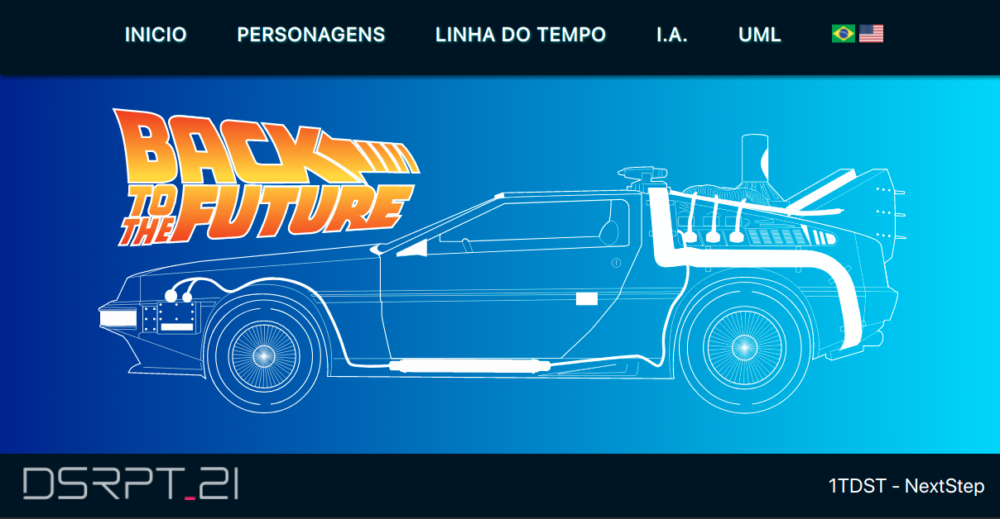
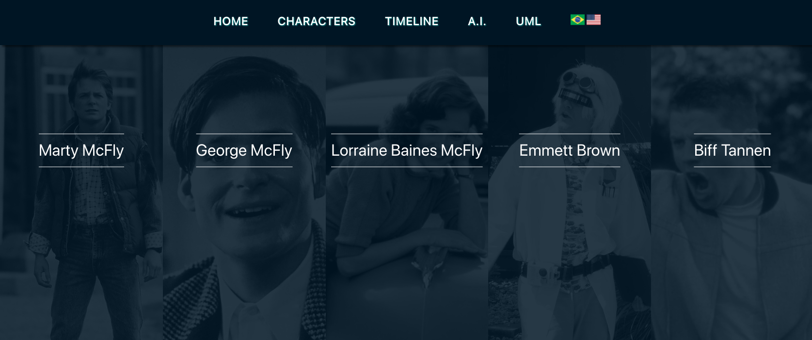

# Projeto: De Volta para o Futuro

Projeto acadêmico com o objetivo de criar uma representação simplificada com a linha do tempo do primeiro filme: De Volta Para O Futuro.

## Acesse o projeto [Aqui](https://disrupt21.herokuapp.com).

## Tecnologias:

1. JSP
2. Servlet
3. Tomcat
4. Maven

<h2>Como Executa o Projeto ?</h2>
<h3>Requisitos para funcionar:</h3>
<ul>
    <li>JDK e JRE Atualizados</li>
    <li>Maven instalado</li>
    <li>Configurar o seu banco MySql (ou outro)</li>
        <ul>
            <li>Alterar a string de conexão jdbc no src/main/java/br/com/nextstep/conexao.java</li>
            <li>coloque a String de conexão no lugar de : <b><code>System.getenv("database_url")</code></b> coloque por exemplo : <b><code>jdbc:mysql://'LinkDeAcesso'/'NomeDoBanco'?user='Usuario'&password='Senha'</code></b></li>
        </ul>
</ul>

### execute o projeto no Main.java no diretório :  (src/main/java/br/com/nextstep/Main.java).
___
## imagens do projeto

 

 

 

